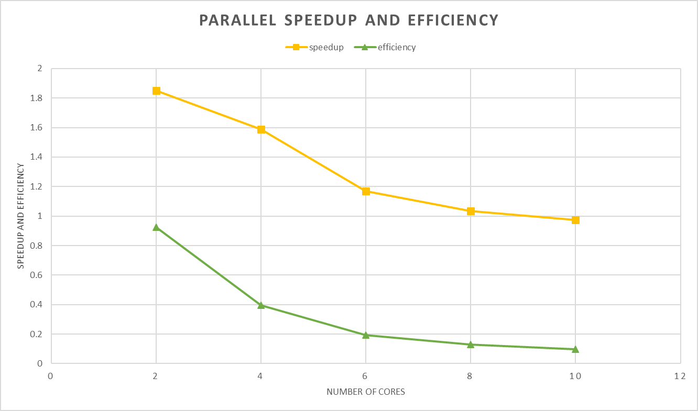

Below data is on medium grid, each trial takes around 5.425 GB of RAM

Including idle RAM usage (3.82 GB), this brings total usage to 9.11/15.5 GB on my local machine. Looks like I won't be able
to do 2 parallel trials without running out of RAM.

$speedup = \frac{\text{wall clock time parallel}}{\text{wall clock time serial}}$
$efficiency = \frac{speedup}{nproc}$

|nproc | secs per iteration | speedup | efficiency |
|------|--------------------|---------|------------|
| 1    | 10 | NA | NA |
| 2    | 5.4 | 1.852 | 0.925 |
| 4    | 3.4 | 1.588 | 0.397 |
| 6    | 2.91 | 1.168 | 0.194 |
| 8    | 2.81 | 1.035 | 0.129 |
| 10   | 2.89 | 0.972 | 0.097 |

Looks like np 6 is best. Speedup looks to go down from there

trial_0 (i.e with base SST model) took around 34 mins (2040 sec) to complete. So, what should the ideal poll time be?

    - Let TIME_BW_POLLS be `p`
    - It seems ax has changed its poll time behaviour. Now, polls follow: $1.25*p + (-1)^n * 0.25*p$, where $n >=1$, with $n = 1$ representing the first poll    
        - In older versions, polls were made as: $(1.5)^n * p$, where $n >= 0$, with $n = 0$ representing the first poll
    - Ideally, i think setting `p` to something small like 1 would be the best bet to minimize wait time between sim completion and polling. But i feel like polling so often may lead to issues, so i'll set it to around 50
