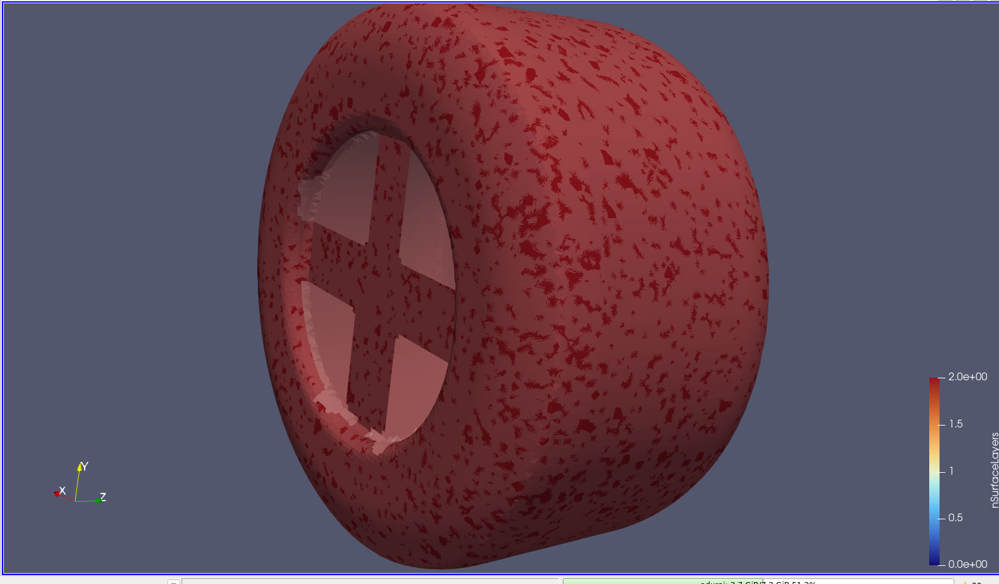

## Milestones

*21-6-26 -* I have a working setup now. 2 million cells, most of it on the wheel, but the sim hasn't diverged for the first 100 steps. Now need to setup parallel exec with foamJob ideally (just to see how it works and whether it will make my life easier) and start a GCI study 

*22-6-26 -* Parallel exec setup 

*24-6-26 -* Mesh is now NOT diverging, cl and cd are reasonable order. Need to next debug why layers cause so much issue (the mesh rn is only castellated and snapped)

## Stuff about model
- This wheel is **330mm diameter** and **180 mm tread width** 
- Contact patch = **1069 mm width** and **105 mm height**
- **Step height** of $0.0028d = 0.0028 * 330 = 0.924 mm$ 
- **Approx frontal area** = 60333 mm^2
-  Domain sizing, 
	- Wheel to top of domain = 5d = 1650 mm
	- Upstream = 5d = 1650 mm
	- Downstream = 10d =3300 mm
	- Sides (left and right) = 3d = 990 mm
- Refinement box sizing:
	- Box 1 : x_ -500 -> 500 
	- Box 2 : x_ -750 -> 1000
	- Box 3 : x_ -1000 -> 2000
- B.C
	- Inlet velocity = 30 m/s
	- Length scale = 0.33 m (wheel dia.)
	- Wheel = rotating wall
		- 181 rad/s == 1736.23 RPM
		- $v = r*\omega$ <= formula for rad/s 
		- wheel center of rotation = (0,165.7,0)
	- y+ target = 100, 5 layers
		- first layer = 2.20e-3
		- $\delta_{99}= 8.57e-3$ 
		- Growth ratio = 1
	- Turbulence params
		- Inlet turbulence intensity = 0.2%
		- $k = 5.40e^{-3} m^2/s^2$
		- $\omega = 2.23 e^{-1} s^{-1}$
		- $\epsilon = 1.08e^{-4} m^2/s^3$
		- $\nu_{t} = 2.42e^{-2} m^2/s$

This is the current snappyLayers I have on 2/7/26. Apparently, this is only a thickness % of 12.7% (i.e as i Understand, this
means only 12.7% of the surface is covered in layers, which doesnt make sense to me looking at the thing).
Why is the wheel rim face not being generated with proper layers?
How much of an issue is it that the contact patch does not have layers?
	- Lets try once without any layers on the contact patch and focus only on getting the main wheel covered in layers
	- Looking at the images, it looks like the mesh at the point where the wheel transitions into the "rim" is coarse, 
		leading to issues with layer collapse. An edge refinement on this should work i think.
		- I created a donut shape around the rim edges, and put them as stls. I tried them like this and it didnt work
		- I put them in baram and saw that that uses an obj under feature refine, trying this
			- This does seem to work. Need to increase the levels over there and then try layers
			- Why does this work? I assume the edges from the obj cause refinement based on feature edges,
				but why doesnt volume refinement work wihtout it?

## Asides
`tar --zstd -cvf archive.tar.zst directories/` to compress files with `zstd`
`tar --zstd -xvf archive.tar.zst` to decompress `.zst` files

## TODO
- [x] the fucking sim is diverging in parallel AND serial. See what can be done about this
	- Seems to be fixed. Changed div(phi,U) from bounded Gauss linearUpwindV grad(U) => bounded Gauss upwind
- [x] Cl and Cd seem to be very wrong even for the initial steps. Probably some issue with forceCoeffs
	- I think my units were wrong
	- There has been a units mismatch. My geometry and mesh were in mm coordinates, but everything else is in meters,
		which is why the cl values are so fucked up
			- Solution - scale geometry and mesh to meters and rerurn. Make sure to update coordinates appropriately
				- Scale both block mesh AND snappyhex mesh
				- Done, and now seems reasonable
- [x] find a way to change inlet/outlet boundary to patch type "inlet" and ground, wheel, contact patch to patch type    
    "wall". put this into the mesh script
		- Change this in block mesh dict when createing patches and under snappy hex mesh surface refinement
- [x] Run a sim until asymptote, and then use tom-teschner's script to find proper runtime controls?
	- runtime controls implemented
- [x] Find a way to get spatial coordinates on the slice export
	- Looks like i have a result `sliceExpo.csv`. Plot it as a contour and compare with paraview
		- Question - What is UNear?
- [x] Make symmetry expansion for cfd plot
- [x] reduce contour plot vertical axis to max 0.14
- [] Start GCI
	- [x] Coarse results done
		- [x] Medium results done
		- [] Fine results done
	- [x] use symmetry conditiion	
	- [x] Get stuff needed for GCI study
	- [x] Calculate error metric
		- When i first calcd the rmse, i was getting NaN values in the interpolated Ug_i. This was because the original expt.
			data measures height in negative coordinates (i.e -0.1587 was the ground). I shifted the reference down to the ground
			and clipped so that negatives get set to 0, and was able to get an rmse value
- Maybe i can put this entire thing on an actual HPC instead of my PC?